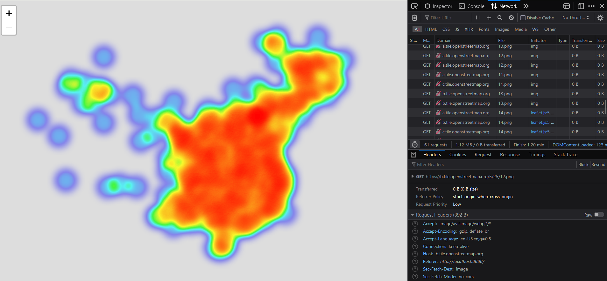
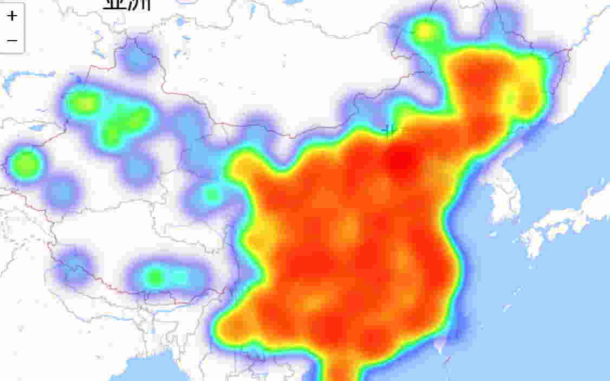
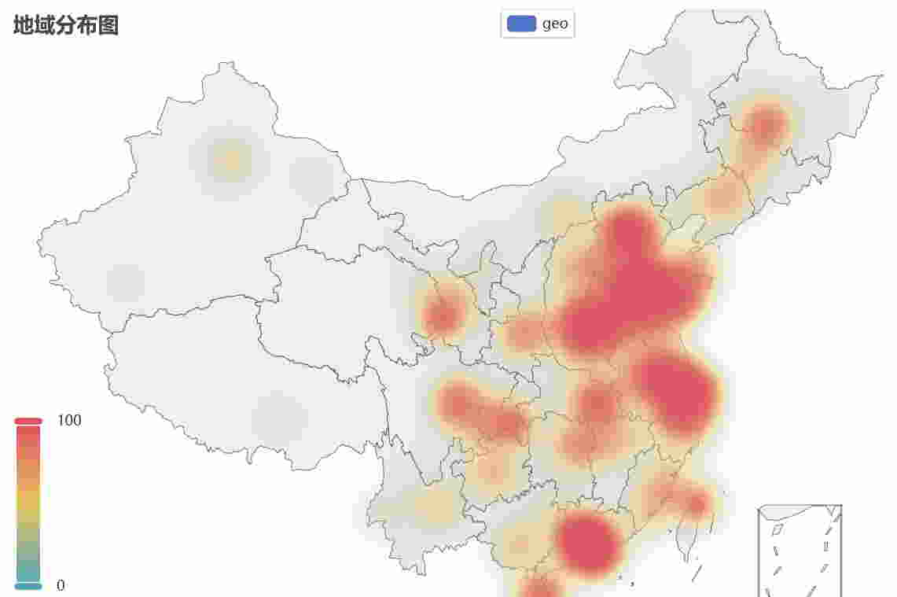

# About

This is a forked version of the cpca project (https://github.com/DQinYuan/chinese_province_city_area_mapper). 

# Purpose

From Github actitivy, it seems cpca has stopped maintenance since 2021.   
During usage, we encountered several problems with cpca.  
Some of the problems are:  

1. Inaccessible map data.  
cpca uses the map patches from openstreetmap.org, which can not be accessed now. 



2. Incompatible issues due to dependency versions.

e.g., `jinja2` and `pyecharts` have import problems for newer versions.

In this repo, we try to revise and fix the above issues. 

## Main Revisions

1. Use map tiles from AMap

```
def heatmap_folium(adcodes, file_path, 
                   tiles= 'https://wprd01.is.autonavi.com/appmaptile?x={x}&y={y}&z={z}&lang=zh_cn&size=1&scl=1&style=7', 
                   attr = 'amap'):
    ...
    map_osm = folium.Map(location=[35, 110], zoom_start=5, 
                         tiles = tiles, attr=attr)
```

2. Fix some issue due to incompatible versions. 

Issue: `ImportError: cannot import name 'environmentfunction' from 'jinja2'`  
Fix: `jinja2==3.0.0`

Issue: `cannot import name 'Geo' from 'pyecharts'`  
Fix: support the latest pyecharts version (We tested for 2.0.x. The old version is 0.5.x).

3. Change map styles.

Use white background maps in `echarts_heatmap()` and `heatmap_folium()`. 

# Install

`pip install cpcax`

# Use

Prepare a list of address codes. The frequency of each code is used the value.
e.g., `['110000','110000','310018']`

## folium heatmap
```
from cpca import drawer
drawer.folium_heatmap(邮编列表, "geos.html")

from IPython.display import IFrame
IFrame(src='geos.html', width=1600, height=900)
```


## echarts heatmap
```
from cpca import drawer
drawer.echarts_heatmap(邮编列表, "echarts_geos.html")

from IPython.display import IFrame
IFrame(src='echarts_geos.html', width=800, height=600)
```



<br/><br/>

## TODO

Expose more style parameters for map visualization.   